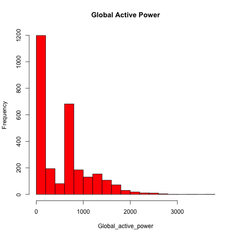
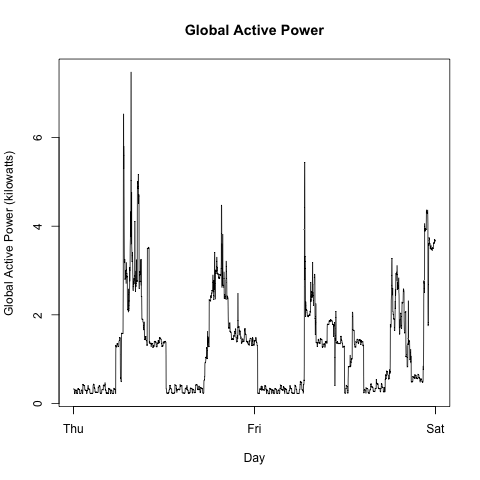
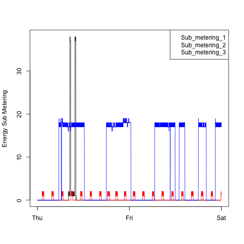
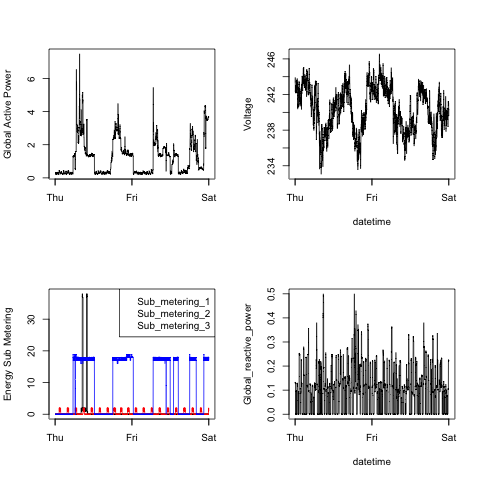

## Introduction

This assignment uses data from
the <a href="http://archive.ics.uci.edu/ml/">UC Irvine Machine
Learning Repository</a>, a popular repository for machine learning
datasets. In particular, we will be using the "Individual household
electric power consumption Data Set" which I have made available on
the course web site:

* <b>Dataset</b>: <a href="https://d396qusza40orc.cloudfront.net/exdata%2Fdata%2Fhousehold_power_consumption.zip">Electric power consumption</a> [20Mb]

* <b>Description</b>: Measurements of electric power consumption in
one household with a one-minute sampling rate over a period of almost
4 years. Different electrical quantities and some sub-metering values
are available.

The following descriptions of the 9 variables in the dataset are taken
from
the <a href="https://archive.ics.uci.edu/ml/datasets/Individual+household+electric+power+consumption">UCI
web site</a>:

<ol>
<li><b>Date</b>: Date in format dd/mm/yyyy </li>
<li><b>Time</b>: time in format hh:mm:ss </li>
<li><b>Global_active_power</b>: household global minute-averaged active power (in kilowatt) </li>
<li><b>Global_reactive_power</b>: household global minute-averaged reactive power (in kilowatt) </li>
<li><b>Voltage</b>: minute-averaged voltage (in volt) </li>
<li><b>Global_intensity</b>: household global minute-averaged current intensity (in ampere) </li>
<li><b>Sub_metering_1</b>: energy sub-metering No. 1 (in watt-hour of active energy). It corresponds to the kitchen, containing mainly a dishwasher, an oven and a microwave (hot plates are not electric but gas powered). </li>
<li><b>Sub_metering_2</b>: energy sub-metering No. 2 (in watt-hour of active energy). It corresponds to the laundry room, containing a washing-machine, a tumble-drier, a refrigerator and a light. </li>
<li><b>Sub_metering_3</b>: energy sub-metering No. 3 (in watt-hour of active energy). It corresponds to an electric water-heater and an air-conditioner.</li>
</ol>

## Loading the data

When loading the dataset into R, please consider the following:

* The dataset has 2,075,259 rows and 9 columns. First
calculate a rough estimate of how much memory the dataset will require
in memory before reading into R. Make sure your computer has enough
memory (most modern computers should be fine).

* We will only be using data from the dates 2007-02-01 and
2007-02-02. One alternative is to read the data from just those dates
rather than reading in the entire dataset and subsetting to those
dates.

* You may find it useful to convert the Date and Time variables to
Date/Time classes in R using the `strptime()` and `as.Date()`
functions.

* Note that in this dataset missing values are coded as `?`.

## Making Plots

Our overall goal here is simply to examine how household energy usage
varies over a 2-day period in February, 2007. 

### Plot 1
The script 'plot1.R' loads the data, subsets the data, and creates the following histogram plot of 'Global Active Power'.

 

### Plot 2
The script 'plot2.R' loads the data, subsets the data, and plots the temporal behavior of 'Global Active Power'.

 

### Plot 3
The script 'plot3.R' loads the data, subsets the data, and plots the temporal beahvior of the three Sub_Metering Varaibles.

 

### Plot 4
The script 'plot3.R' loads the data, subsets the data, and generates the following quad plot.

 

